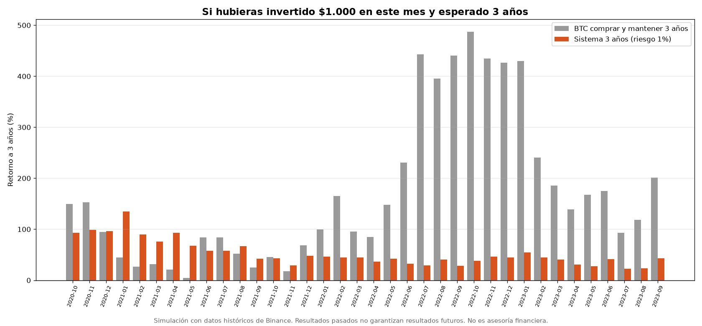
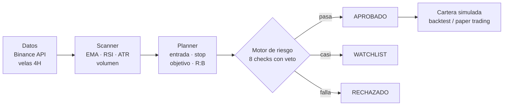
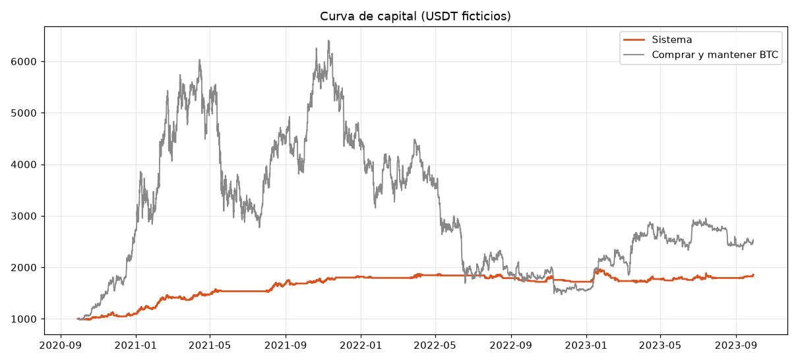
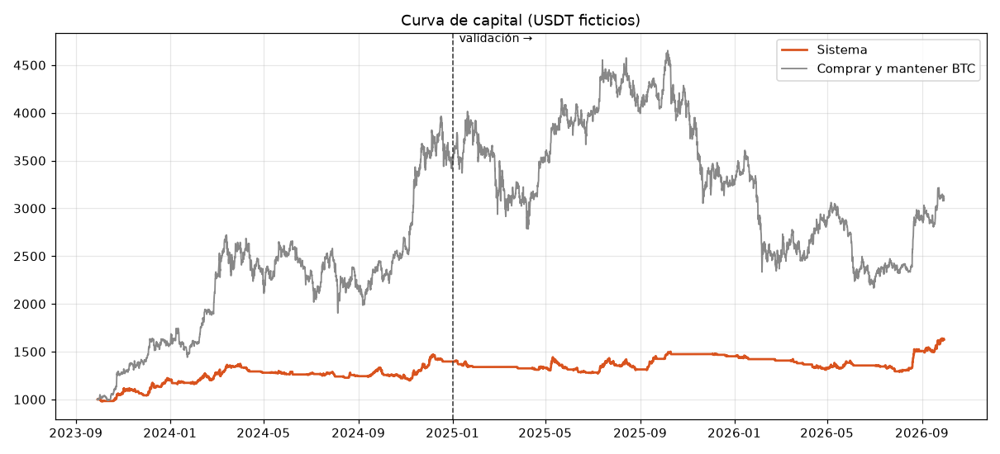
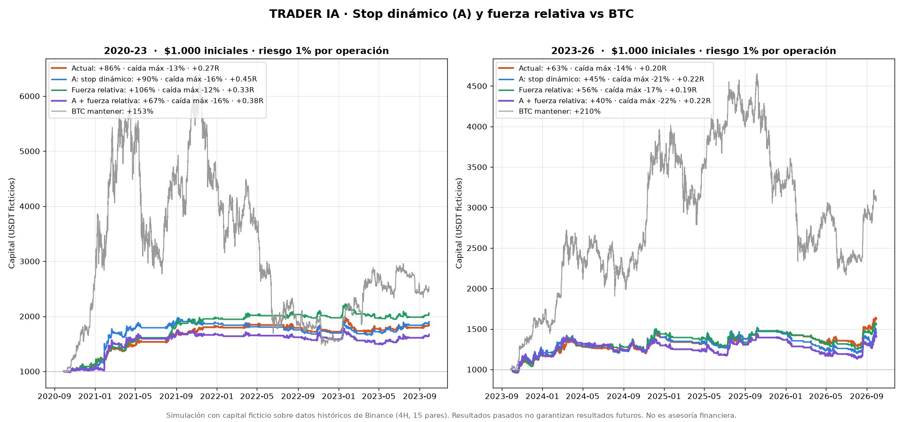
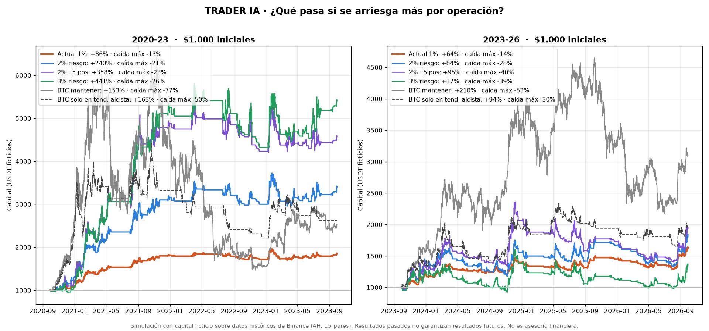
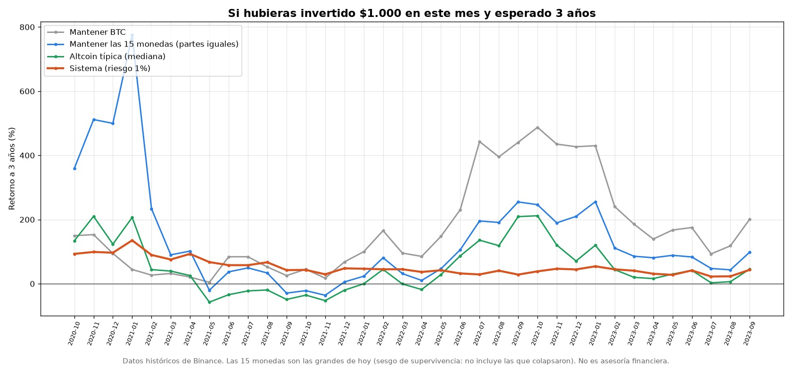

# Trader cripto algorítmico: ¿le gana a comprar y mantener?

Sistema de trading en Python que escanea 15 criptomonedas, detecta oportunidades con reglas explícitas,
arma el plan de cada operación y lo somete a un motor de riesgo con veto. Lo evalué con un backtest
vela a vela sobre **6 años de datos reales** (2020–2026), cuidando no hacerme trampa con la validación.

**Conclusión:** el sistema gana plata de forma consistente y cae mucho menos que el mercado,
pero **en retorno no le gana a comprar BTC y mantenerlo** en 3 de cada 4 escenarios.

> Proyecto de análisis con capital ficticio. No opera con dinero real ni se conecta a ninguna cuenta.
> No es asesoría financiera.



---

## La pregunta

Inspirado en un carrusel de TikTok sobre un "trader IA 24/7", quise responder con datos:
**¿un sistema de reglas que busca oportunidades, planifica y controla el riesgo rinde más que simplemente
comprar y esperar?**

## Resultado en una tabla

$1.000 invertidos en cada uno de los **36 meses posibles de inicio** (oct-2020 a sep-2023), con plazo de 3 años:

| | Sistema | Mantener BTC | Mantener 15 monedas | Altcoin típica |
|---|---|---|---|---|
| Retorno típico (mediana) | +45% | **+129%** | +87% | +35% |
| Peor resultado a 3 años | **+22%** | +4% | −36% | — |
| Lo más bajo que llegaron los $1.000 | **$931** | $262 | $239 | — |
| Veces que el sistema gana | — | 9 de 36 | 11 de 36 | 21 de 36 |

- **Sistema:** retorno moderado y muy estable. Nunca terminó en pérdida y el capital casi nunca bajó de lo invertido.
- **BTC:** más retorno en 27 de 36 casos, pero en la mitad de ellos los $1.000 pasaron por menos de $600.
- **Altcoins:** una lotería. SOL rindió +318% típico; DOT perdió en 34 de 36 casos.

## Cómo funciona



| Módulo | Qué hace |
|---|---|
| `datos.py` | Descarga velas cerradas desde la API pública de Binance (sin clave) |
| `scanner.py` | Indicadores y setups como reglas explícitas: Ruptura, Momentum, Reversión (Pullback y Continuación desactivados tras el backtest) |
| `planner.py` | Stop bajo el mínimo reciente (1–3 ATR), objetivo en la resistencia siguiente o 2R |
| `riesgo.py` | R:B mínimo, volatilidad, puntaje, filtro de tendencia, tamaño por riesgo (1%), máx. posiciones, exposición y pérdida total |
| `cartera.py` | Motor de simulación **compartido** por el backtest y el paper trading (misma lógica exacta) |
| `backtest.py` | Backtest vela a vela con costos, tramos de entrenamiento/validación y reporte Excel |
| `paper.py` | Paper trading en tiempo real (tarea programada cada hora) |
| `main.py` | Escaneo del momento con reporte Excel |
| `analisis/` | Scripts que generan los gráficos de este README |

## Metodología: cómo evité engañarme

| Riesgo | Qué hice |
|---|---|
| **Mirar el futuro** | En cada vela el sistema solo ve el pasado. Indicadores causales; resistencias confirmadas solo con 3 velas posteriores |
| **Resultados irreales** | Entrada en la apertura siguiente, comisión 0,1% por lado, 0,05% de deslizamiento; si una vela toca stop y objetivo, se asume stop |
| **Sobreajuste** | Historia separada en entrenamiento (2023–24) y validación (2025–26). Después, prueba sobre **2020–23, datos nunca vistos** |
| **Autoengaño en las mejoras** | Criterio de adopción fijado **antes** de correr cada prueba y parámetros sin optimizar |
| **Errores de código** | Prueba de regresión tras cada refactor; el estado del paper trading se verificó guardando y recargando en 12 tramos (resultado idéntico) |

## Qué se probó y qué se descartó

| Cambio | Resultado | Decisión |
|---|---|---|
| Eliminar Pullback y Continuación | Perdían en ambos tramos (−0,12R y −0,17R) | ✅ Adoptado |
| Operar solo en tendencia alcista | +0,16R → **+0,27R** en datos nunca vistos | ✅ Adoptado (confirmado fuera de muestra) |
| Stop dinámico (trailing) | Más ganancia por operación, pero menos operaciones y más caída en 2023–26 | ❌ Descartado |
| Fuerza relativa vs BTC | Mejora 2020–23, empeora 2023–26 | ❌ Descartado |
| Subir el riesgo a 2–3% | Multiplica la ganancia en 2021, pero con 3% rinde **menos** que con 1% en 2023–26 | ❌ No adoptado |

**Un error propio que corregí:** el filtro de tendencia lo elegí mirando toda la historia, lo que contaminaba
la validación. Lo reconocí y lo sometí a una prueba limpia sobre 2020–23 antes de darlo por bueno.

| Periodo | Operaciones | Win rate | Expectativa | Retorno | Caída máx. | BTC |
|---|---|---|---|---|---|---|
| 2020–23 (fuera de muestra) | 250 | 48,8% | +0,27R | +86% | −13% | +153% (caída −77%) |
| 2023–26 | 300 | 47,3% | +0,20R | +63% | −14% | +210% (caída −53%) |

_R = lo que se arriesga por operación (1% del capital). +0,27R ≈ se gana en promedio el 27% de lo arriesgado por operación._

<details>
<summary>Más gráficos</summary>

**Curva de capital 2020–23 (datos nunca vistos)**


**Curva de capital 2023–26**


**Stop dinámico y fuerza relativa vs versión actual**


**Efecto de subir el riesgo por operación**


**Sistema vs mantener otras monedas**


</details>

## Conclusiones

1. **Un backtest bien hecho sirve sobre todo para descartar.** De 8 variantes probadas, solo 2 se adoptaron.
2. **El sistema tiene una ventaja real pero delgada** (+0,20R a +0,27R), estable en 3 años de mercado muy distintos.
3. **En retorno absoluto no le gana a BTC**, entre otras razones porque tiene invertido solo un ~15% del capital en promedio. Su valor está en el control de la caída, no en el retorno.
4. **La comparación depende del periodo:** 2020–2026 fue excepcional para BTC. Si el mercado se estanca, la conclusión podría cambiar.

**Limitaciones:** solo compras (spot), sin ventas en corto. Sesgo de supervivencia: los 15 pares son los grandes de hoy
(no incluye monedas que colapsaron, como LUNA o FTT). El paper trading comenzó el 29-09-2026 y necesita más de un año
de operaciones para confirmar la expectativa con significancia.

## Cómo correrlo

```bash
pip install -r requirements.txt
python main.py                                          # escaneo del momento → resultados/scan_*.xlsx
python backtest.py                                      # backtest últimos 3 años → resultados/backtest_*.xlsx
python backtest.py --desde 2020-09-29 --hasta 2023-09-29   # cualquier periodo
python paper.py                                         # paper trading (una pasada; en Windows corre cada hora con una tarea programada)
```

Todos los parámetros están en [`config.yaml`](config.yaml), incluidos los interruptores de las mejoras descartadas.
La primera corrida del backtest descarga ~10 MB de historia a `datos_historicos/`; las siguientes solo lo nuevo.

El detalle cronológico de cada prueba está en [`docs/BITACORA_TECNICA.md`](docs/BITACORA_TECNICA.md) y el resumen
ejecutivo en [`docs/informe.pdf`](docs/informe.pdf).

---

**Stack:** Python · pandas · ccxt · matplotlib · openpyxl · YAML · Programador de tareas de Windows

**Autor:** Tomás Moya Araya · Ingeniero Civil Industrial · [LinkedIn](https://linkedin.com/in/tomasmoyaaraya)
